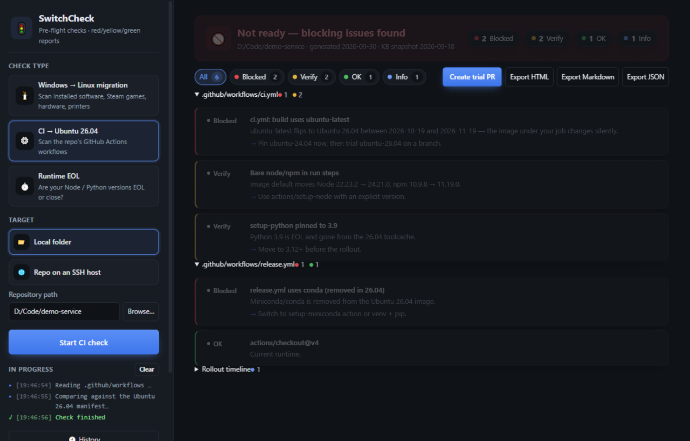

[English](README.md) | [简体中文](README.zh-CN.md) | **日本語**

# 🚦 SwitchCheck

**環境を切り替える前に、事前ヘルスチェックを。**
今ある環境をスキャンし、移行先と照合して、赤 / 黄 / 緑の判定を表示 —— CLI でも、フルビジュアルのデスクトップアプリでも。

[](https://github.com/kongliuli/switchcheck/actions/workflows/ci.yml)
[](https://github.com/kongliuli/switchcheck/actions/workflows/release.yml)
[](LICENSE)


開発者は理不尽な環境移行を強いられます —— SwitchCheck は、切り替える前に**「自分の環境はちゃんと動くのか？」**に答えます。

| チェック | 対象となる切り替え | スキャン内容 |
|---|---|---|
| 🐧 **linux** | Windows デスクトップから **Linux** への移行 | インストール済みソフト、Steam ゲーム、GPU、Wi-Fi、プリンター |
| ⚙️ **ci** | GitHub Actions の `ubuntu-latest` が **Ubuntu 26.04** へ静かに切り替わる（2026-10-19 〜 11-19） | `.github/workflows/*` |
| ⏱️ **runtime** | 固定したランタイムの **EOL**（Node 20 は 2026-04-30 終了、Python 3.10 は 2026-10-31 に追随） | `engines.node`、`.nvmrc`、`.node-version`、`.python-version`、`requires-python` |

3つとも内部は同じ仕組みです：`scan(source) × knowledge-base(target) → findings`。結果は 🔴 ブロック / 🟡 要確認 / 🟢 OK / ℹ️ 情報 の 4 段階で表示されます。

---

## 🖥️ デスクトップアプリ



```bash
npm install
npm run gui
```

CLI と同じエンジンを搭載した、中国語 UI のフルビジュアル・デスクトップアプリ（ライト/ダーク対応）：

- **1 つのウィンドウに 3 つのチェック** —— 種類を選び、ターゲットを選び、ワンクリックで実行。
- **ローカルでも SSH でも** —— このマシン、ローカルフォルダ、あるいは SSH 経由でリモートの Windows/Linux ホストをスキャン。進捗はリアルタイム表示。
- **赤黄緑の結果ビュー** —— 判定バナー、セクション別カウント、ステータスフィルターチップ、推奨事項のワンクリックコピー。
- **SSH 接続マネージャー** —— 複数ホストを保存（パスワード/秘密鍵は OS の資格情報ストアで暗号化、平文でディスクに保存されない）、ホスト鍵フィンガープリントのピン留め（TOFU、変更時は認証前にブロック）、接続テスト、インポート/エクスポート。
- **試験用 PR / 修正 YAML をワンクリック** —— ローカルの CI チェック後、`ubuntu-26.04` にピン留めした PR を開くか、workflow ファイルをローカルで書き換えます。
- **チェック履歴** —— 実行ごとにローカル保存。過去のレポートを開き、前回との差分（新規 / 変化 / 解決済み）を確認。
- **自動アップデート** —— バックグラウンドで確認、サイレントダウンロード、ワンクリックで再起動（GitHub Releases）。
- **三言語 UI** —— 简体中文 / English / 日本語、アプリ内でワンクリック切替。エクスポートも UI 言語に追従。
- レポートは中国語 **HTML**、Markdown、JSON でエクスポート可能。

**Windows / macOS / Linux** 向けインストーラーは各[リリース](https://github.com/kongliuli/switchcheck/releases)に添付（レビュー完了まではドラフト）—— 自分でビルドする場合は `npm run dist:win|dist:mac|dist:linux`。

## ⌨️ CLI

```bash
npm install -g switchcheck    # または: npx switchcheck <command>
```

### `switchcheck linux` —— この Windows マシンは Linux で生き残れるか？

Windows マシン上で実行（読み取り専用）：インストール済みソフト（レジストリ）、Steam ライブラリ（`libraryfolders.vdf` + マニフェスト）、GPU / ネットワークアダプタ、プリンター。`data/` のナレッジベースと照合：

- **アプリケーション** → ネイティブ対応 / 代替あり / Wine で動作 / 使用不可 —— 中国で定番のソフト（WeChat、QQ、DingTalk、WPS、深信服 VPN、入力メソッド、税務・銀行コントロール…）を網羅し、Windows のシステムノイズは除外
- **Steam ゲーム** → ネイティブ / Proton / アンチチートでブロック
- **ハードウェア** → NVIDIA ドライバの注意点、Wi-Fi（あの Broadcom 問題含む）、ドライバーレス IPP プリンター
- **ハードブロッカー** は率直に指摘：税務管理プラグイン、銀行 USB キー、カーネルレベル・アンチチート

出力：ターミナル + `switchcheck-linux-report.md` + 自己完結の HTML レポート（`--open` で表示）。

### `switchcheck ci [path]` —— CI は Ubuntu 26.04 に対応しているか？

`.github/workflows/` をスキャンし、公式 runner-images の Ubuntu 24.04 vs 26.04 マニフェストと照合：runner ラベル、アクションのランタイム（node16/node20）、イメージ既定のツールチェーン（Node 22→24、Python 3.12→3.14、JDK 17→25、CMake 3→4…）、ピン留めされたバージョン、26.04 イメージから**削除された**ツール（conda、Swift、Julia…）、apt のメジャー変更。

ワンクリック試験 —— 切り替え前に CI 自身に実証させます：

```bash
switchcheck ci --trial          # ubuntu-26.04 にピン留めしたブランチを作成し PR をオープン（gh 経由）
switchcheck ci --fix --dry-run  # 同じ書き換えをローカル diff でプレビュー
switchcheck ci --fix            # workflow ファイルをその場で書き換え（git diff で確認）
switchcheck ci --fail-on red    # CI 用：レッドがあれば終了コード 1
```

### `switchcheck runtime [path]` —— 宣言したランタイムはもうすぐ死なないか？

プロジェクトが宣言しているランタイムバージョンを読み取り、**ベースライン**（最低サポート版本）を EOL スケジュールと照合：

```text
✖ Node.js 18 はセキュリティ保守を終了      EOL 2025-04-30（518 日前）
✔ Node.js 22 はサポート中                  2027-04-30 まで
⚠ Python 3.10 はまもなく EOL               EOL 2026-10-31（残り 31 日）
```

## 🌐 SSH でリモートマシンをチェック

デスクトップアプリは、**リモートの Windows ホスト**を Linux チェックでスキャンできます（同じ PowerShell コレクタを `-EncodedCommand` でリモート実行、Steam ライブラリは SFTP 経由で読み取り）。CI/runtime チェックは**任意のホスト上のリポジトリ**を SFTP で読み取ります。セキュリティ対応済み：ホスト鍵 TOFU ピン留め（変更時は認証前にハードストップ）、操作ごとのタイムアウト、分かりやすいエラーメッセージ —— ターゲットで OpenSSH Server を有効にするだけ。

## 🧠 ナレッジベースはコードではなくデータ

`data/*.json` はプレーンで、日付付き、出典明記 —— 最高の PR は JSON の 1 行編集です：

- `ubuntu-images.json` —— runner-images の Ubuntu 24.04/26.04 マニフェスト + アクションランタイムの確認
- `runtime-eol.json` —— Node.js / Python の公式 EOL スケジュール
- `linux-apps.json` / `linux-hardware.json` / `steam-games.json` —— 手動キュレーション、コミュニティ拡充歓迎

## ✅ 判定と終了コード

各所見は 🔴 ブロック / 🟡 要確認 / 🟢 OK / ℹ️ 情報。全体の判定は最も悪い項目です。`--fail-on red`（または `yellow`）で終了コード 1 —— CI で使えます。このリポジトリ自体もドッグフーディング：独自の CI で `switchcheck ci . --fail-on red` を実行しています。

## 🛠 開発

```bash
npm install
npm test        # node:test、57 テスト
npm run gui     # デスクトップアプリ
```

```
bin/switchcheck.js      CLI エントリ
src/engine.js           finding モデルと判定（共有コア）
src/checks.js           ターゲット解決と全チェックのオーケストレーション
src/ci/                 workflow スキャナ、26.04 ルール、--trial PR 生成
src/runtime/            ランタイム宣言スキャナ + EOL ルール
src/desktop/            Windows コレクタ（PowerShell CIM/レジストリ）、Steam VDF パーサ、ルール
src/ssh.js              SSH トランスポート：ホスト鍵 TOFU、タイムアウト、リモート PowerShell + SFTP
src/gui/                Electron アプリ（main + preload + renderer + プロファイルストア）
data/                   ナレッジベース
docs/ui-design-spec.md  GUI デザインシステムとユーザビリティ計画
```

## 🗺 ロードマップ

- npm 公開 + GitHub Action マーケットプレイス登録
- 同じエンジンを **Windows 2025** イメージ切り替えと macOS ランナー変更に対応
- 匿名化した `--json` 出力からナレッジベースをクラウドソーシング

## License

MIT
