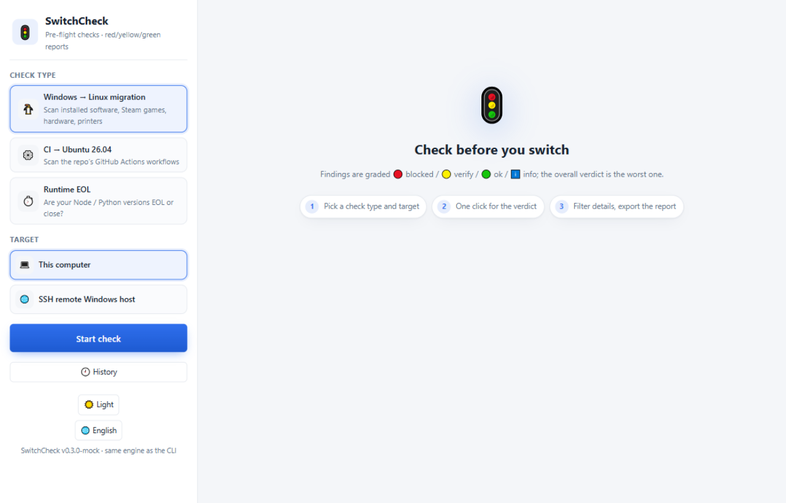

# 🚦 SwitchCheck

**English** | [简体中文](README.zh-CN.md) | [日本語](README.ja.md)

**Pre-flight checks before you switch environments.**
Scan what you actually have, diff it against the target environment, and get a red / yellow / green verdict — from a CLI or a fully visual desktop app.

[](https://github.com/kongliuli/switchcheck/actions/workflows/ci.yml)
[](https://github.com/kongliuli/switchcheck/actions/workflows/release.yml)
[](LICENSE)




Three switches people are forced through — SwitchCheck answers *"will **my** stuff survive it?"* before you flip:

| Check | The switch it de-risks | What it scans |
|---|---|---|
| 🐧 **linux** | A Windows desktop moving to **Linux** | installed software, Steam games, GPUs, Wi-Fi, printers |
| ⚙️ **ci** | GitHub Actions `ubuntu-latest` silently flips to **Ubuntu 26.04** (between 2026-10-19 and 2026-11-19) | `.github/workflows/*` |
| ⏱️ **runtime** | Your pinned runtime going **EOL** (Node 20 died 2026-04-30; Python 3.10 follows 2026-10-31) | `engines.node`, `.nvmrc`, `.node-version`, `.python-version`, `requires-python` |

All three are the same machine underneath: `scan(source) × knowledge-base(target) → findings`, rendered as 🔴 blocking / 🟡 verify / 🟢 ok / ℹ️ info.

---

## 🖥️ Desktop app


```bash
npm install
npm run gui
```

A fully visual desktop app (light/dark, 简体中文/English/日本語) on the same engine as the CLI:

- **Three checks, one window** — pick the type, pick the target, one click.
- **Any target, local or SSH** — scan this machine, a local folder, or a remote Windows/Linux host over SSH with live progress.
- **红黄绿结果页** — verdict banner, per-section counts, status filter chips, one-click copy of any recommendation.
- **SSH connection manager** — multiple saved hosts, password or private key (secrets encrypted with the OS credential store, never plaintext), host-key fingerprint pinning (TOFU) that hard-stops on change, connectivity test, import/export.
- **体检历史** — every check is saved locally; open an old report and diff it against the previous run (新增 / 已解决).
- **创建试跑 PR** — after a local CI check, one click opens a PR that pins `ubuntu-26.04`, so CI itself proves the migration.
- **Auto-update** — background check, silent download, one-click restart (GitHub Releases).
- **Trilingual UI** — 简体中文 / English / 日本語, switchable in-app; exports follow the UI language.
- Export reports as **HTML** (localized), Markdown, or JSON.

Installers for **Windows / macOS / Linux** are attached to each [release](https://github.com/kongliuli/switchcheck/releases) (draft until reviewed) — or build your own with `npm run dist:win|dist:mac|dist:linux`.

## ⌨️ CLI

```bash
npm install -g switchcheck    # or: npx switchcheck <command>
```

### `switchcheck linux` — will my Windows machine survive Linux?

Runs on the Windows machine (read-only): installed software (registry), the Steam library (`libraryfolders.vdf` + app manifests), GPU / network adapters, printers. Matched against knowledge bases in `data/`:

- **Applications** → native build / good alternative / runs under Wine / blocked — including Chinese desktop staples (WeChat, QQ, DingTalk, WPS, 深信服 VPN, 输入法, 税控/网银控件…) with Windows bookkeeping noise filtered out
- **Steam games** → native / Proton / anti-cheat-blocked
- **Hardware** → NVIDIA driver caveats, Wi-Fi (incl. the Broadcom pain), printers via driverless IPP
- **Hard blockers** get called out honestly: tax-control plugins, bank USB keys, kernel anti-cheat

Output: terminal + `switchcheck-linux-report.md` + a self-contained HTML report (`--open`).

### `switchcheck ci [path]` — is my CI ready for Ubuntu 26.04?

Scans `.github/workflows/` against the official runner-images manifests for Ubuntu 24.04 vs 26.04: runner labels, action runtimes (node16/node20), image-default toolchains (Node 22→24, Python 3.12→3.14, JDK 17→25, CMake 3→4…), pinned versions, tools **removed** from the 26.04 image (conda, Swift, Julia…), apt majors.

One-click trial — prove the migration before the flip:

```bash
switchcheck ci --trial          # creates a branch pinning ubuntu-26.04 and opens a PR (via gh)
switchcheck ci --fail-on red    # exit 1 for CI
```

### `switchcheck runtime [path]` — is my declared runtime about to die?

Reads the versions your project declares and checks the **baseline** against the EOL schedule:

```text
✖ Node.js 18 已停止安全维护      EOL 2025-04-30（已是 518 天前）
✔ Node.js 22 受支持              维护至 2027-04-30
⚠ Python 3.10 即将停止维护       EOL 2026-10-31（还剩 31 天）
```

## 🌐 Check a remote machine over SSH

The desktop app can scan a **remote Windows host** for the Linux check (the same PowerShell collectors run remotely via `-EncodedCommand`; the Steam library is read over SFTP) and scan **any host's repository** for the CI/runtime checks (plain SFTP). Hardening included: host-key TOFU pinning with a pre-auth hard stop on change, per-operation timeouts, and plain-language errors — enable OpenSSH Server on the target and go.

## 🧠 Knowledge bases are data, not code

`data/*.json` are plain, dated, and sourced — the best PR is a JSON edit:

- `ubuntu-images.json` — runner-images Ubuntu 24.04/26.04 manifests + action runtime checks
- `runtime-eol.json` — Node.js / Python EOL schedule
- `linux-apps.json` / `linux-hardware.json` / `steam-games.json` — curated, community-extendable

## ✅ Verdicts & exit codes

Every finding is 🔴 blocking / 🟡 review / 🟢 ok / ℹ️ info; the overall verdict is the worst finding. `--fail-on red` (or `yellow`) exits 1 — use it in CI. The repo dogfoods it: its own CI runs `switchcheck ci . --fail-on red`.

## 🛠 Development

```bash
npm install
npm test        # node:test, 57 tests, no extra dev deps needed
npm run gui     # the desktop app
```

```
bin/switchcheck.js      CLI entry
src/engine.js           finding model + verdicts (shared core)
src/checks.js           target resolution + orchestration for all checks
src/ci/                 workflow scanner, 26.04 rules, --trial PR generator
src/runtime/            runtime-declaration scanner + EOL rules
src/desktop/            Windows collector (PowerShell CIM/registry), Steam VDF parser, rules
src/ssh.js              SSH transport: host-key TOFU, op timeouts, remote PowerShell + SFTP
src/gui/                Electron app (main + preload + renderer + profile store)
data/                   the knowledge bases
docs/ui-design-spec.md  the GUI design system & usability plan
```

## 🗺 Roadmap

- Publish to npm + GitHub Action marketplace entry
- The same engine against the **Windows 2025** image flip and macOS runner changes
- `--fix` mode: emit the upgraded workflow YAML, not just advice
- Crowdsource KB coverage from anonymized `--json` output

## 中文说明

完整中文文档见 [README.zh-CN.md](README.zh-CN.md)。

## License

MIT
