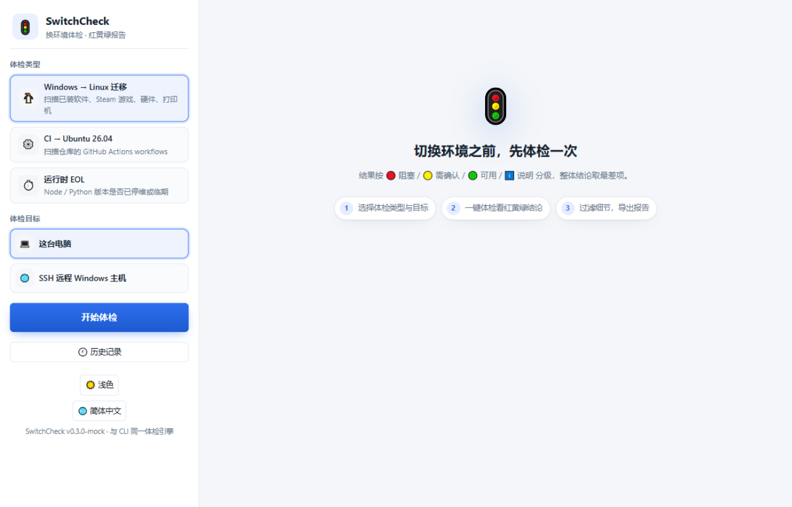
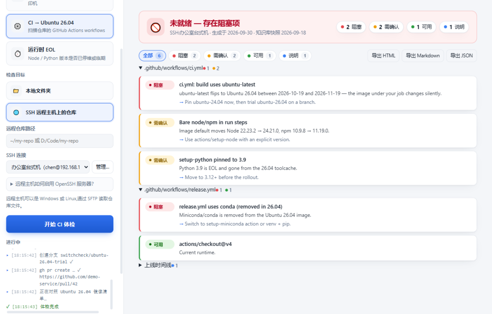

[English](README.md) | **简体中文** | [日本語](README.ja.md)

# 🚦 SwitchCheck

**换环境之前，先做一次体检。**
扫描你实际拥有的东西，与目标环境比对，给出红 / 黄 / 绿结论 —— 既有 CLI，也有全可视化的桌面应用。

[](https://github.com/kongliuli/switchcheck/actions/workflows/ci.yml)
[](https://github.com/kongliuli/switchcheck/actions/workflows/release.yml)
[](LICENSE)




三种人们被迫经历的"换环境"—— SwitchCheck 在你动手之前回答：**"我的东西能活下来吗？"**

| 体检 | 化解的切换 | 扫描内容 |
|---|---|---|
| 🐧 **linux** | Windows 桌面迁移到 **Linux** | 已装软件、Steam 游戏、GPU、Wi-Fi、打印机 |
| ⚙️ **ci** | GitHub Actions 的 `ubuntu-latest` 静默切换到 **Ubuntu 26.04**（2026-10-19 至 11-19 之间） | `.github/workflows/*` |
| ⏱️ **runtime** | 你锁定的运行时 **EOL**（Node 20 已于 2026-04-30 停维；Python 3.10 将于 2026-10-31 跟进） | `engines.node`、`.nvmrc`、`.node-version`、`.python-version`、`requires-python` |

三者底层是同一台机器：`scan(source) × knowledge-base(target) → findings`，以 🔴 阻塞 / 🟡 需确认 / 🟢 可用 / ℹ️ 说明 四级呈现。

---

## 🖥️ 桌面应用



```bash
npm install
npm run gui
```

与 CLI 同引擎的全可视化中文桌面应用（亮/暗主题）：

- **一个窗口三种体检** —— 选类型、选目标、一键开跑。
- **任意目标，本机或 SSH** —— 体检本机、本地文件夹，或通过 SSH 体检远程 Windows/Linux 主机，进度实时可见。
- **红黄绿结果页** —— 结论横幅、分区计数、状态过滤芯片、一键复制任何建议。
- **SSH 连接管理器** —— 保存多台主机，密码或私钥（密钥经操作系统级加密存储，绝不落盘明文），主机密钥指纹绑定（TOFU，变更即拦截），连通性测试，导入导出。
- **体检历史** —— 每次体检自动存本地；打开旧报告，与上一次对比（新增 / 状态变化 / 已解决）。
- **创建试跑 PR / 生成修复 YAML** —— 本地 CI 体检完成后，一键开 PR 把 job 钉到 `ubuntu-26.04`，或就地改写 workflow 文件。
- **自动更新** —— 后台检查、静默下载、一键重启（GitHub Releases）。
- **三语界面** —— 简体中文 / English / 日本語，应用内一键切换；导出报告跟随界面语言。
- 任何报告可导出为中文 **HTML**、Markdown 或 JSON。

**Windows / macOS / Linux** 安装包附在每个 [Release](https://github.com/kongliuli/switchcheck/releases)（审核前为草稿）—— 也可以自己构建：`npm run dist:win|dist:mac|dist:linux`。

## ⌨️ CLI

```bash
npm install -g switchcheck    # 或：npx switchcheck <command>
```

### `switchcheck linux` —— 我的 Windows 机器能适应 Linux 吗？

在 Windows 机器上运行（只读）：已装软件（注册表）、Steam 库（`libraryfolders.vdf` + 清单）、GPU / 网卡、打印机。与 `data/` 中的知识库比对：

- **应用程序** → 原生可用 / 有替代品 / 可跑 Wine / 无法使用 —— 覆盖国内常用软件（微信、QQ、钉钉、WPS、深信服 VPN、输入法、税控/网银控件…），并过滤掉 Windows 的记账噪音
- **Steam 游戏** → 原生 / Proton / 反作弊封锁
- **硬件** → NVIDIA 驱动注意事项、Wi-Fi（含 Broadcom 之痛）、免驱 IPP 打印
- **硬阻塞**毫不留情地指出：税控插件、网银 U 盾、内核级反作弊

输出：终端 + `switchcheck-linux-report.md` + 自包含 HTML 报告（`--open` 打开）。

### `switchcheck ci [path]` —— 我的 CI 准备好 Ubuntu 26.04 了吗？

扫描 `.github/workflows/`，对照官方 runner-images 的 Ubuntu 24.04 vs 26.04 清单：runner 标签、action 运行时（node16/node20）、镜像默认工具链（Node 22→24、Python 3.12→3.14、JDK 17→25、CMake 3→4…）、锁定版本、26.04 镜像**移除**的工具（conda、Swift、Julia…）、apt 大版本变化。

一键试跑 —— 在正式切换前让 CI 自己证明：

```bash
switchcheck ci --trial          # 创建把 ubuntu-26.04 钉死的分支并开 PR（经 gh）
switchcheck ci --fix --dry-run  # 以本地 diff 形式预览同样的改写
switchcheck ci --fix            # 就地改写 workflow 文件（git diff 查看）
switchcheck ci --fail-on red    # 供 CI 使用，存在红灯则退出码 1
```

### `switchcheck runtime [path]` —— 我声明的运行时快死了吗？

读取项目声明的运行时版本，把**基线版本**（你声称支持的最低版本）对照 EOL 时间表：

```text
✖ Node.js 18 已停止安全维护      EOL 2025-04-30（已是 518 天前）
✔ Node.js 22 受支持              维护至 2027-04-30
⚠ Python 3.10 即将停止维护       EOL 2026-10-31（还剩 31 天）
```

## 🌐 通过 SSH 体检远程机器

桌面应用可以体检**远程 Windows 主机**的 Linux 迁移（同一套 PowerShell 采集器经 `-EncodedCommand` 远程执行；Steam 库通过 SFTP 读取），也可以通过 SFTP 读取**任意主机的仓库**做 CI/runtime 体检。内置加固：主机密钥 TOFU 指纹绑定（变更即在认证前拦截）、逐操作超时、通俗中文报错 —— 目标机器启用 OpenSSH 服务器即可。

## 🧠 知识库是数据，不是代码

`data/*.json` 纯净、带日期、有出处 —— 最好的 PR 就是一处 JSON 修改：

- `ubuntu-images.json` —— runner-images 的 Ubuntu 24.04/26.04 清单 + action 运行时检查
- `runtime-eol.json` —— Node.js / Python 官方 EOL 时间表
- `linux-apps.json` / `linux-hardware.json` / `steam-games.json` —— 人工整理，欢迎社区扩充

## ✅ 判定与退出码

每条发现为 🔴 阻塞 / 🟡 需确认 / 🟢 可用 / ℹ️ 说明；整体结论取最差项。`--fail-on red`（或 `yellow`）时退出码 1 —— 在 CI 里用。本仓库自食其力：自己的 CI 会跑 `switchcheck ci . --fail-on red`。

## 🛠 开发

```bash
npm install
npm test        # node:test，57 个测试
npm run gui     # 桌面应用
```

```
bin/switchcheck.js      CLI 入口
src/engine.js           finding 模型与判定（共享核心）
src/checks.js           目标解析与所有体检的编排
src/ci/                 workflow 扫描器、26.04 规则、--trial PR 生成
src/runtime/            运行时声明扫描器 + EOL 规则
src/desktop/            Windows 采集器（PowerShell CIM/注册表）、Steam VDF 解析、规则
src/ssh.js              SSH 传输：主机密钥 TOFU、操作超时、远程 PowerShell + SFTP
src/gui/                Electron 应用（main + preload + renderer + 配置存储）
data/                   知识库
docs/ui-design-spec.md  GUI 设计系统与易用性计划
```

## 🗺 路线图

- 发布到 npm + GitHub Action 市场
- 同一引擎支持 **Windows 2025** 镜像切换与 macOS runner 变化
- 从匿名化的 `--json` 输出众包知识库覆盖

## License

MIT
